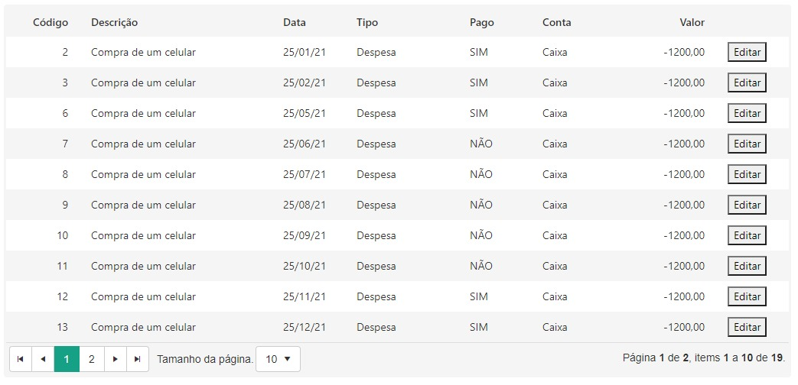

Modelo do grid para os componentes

#Modelo 1

Para adicionar em seu projeto, proceda da seguinte forma:

Baixe o arquivo: https://github.com/SilvanoGMatta/GvinciStyles/blob/main/BootStrap/Grid/Model1/gridPersonalizadoModel1.css

Adicione-o  em css
